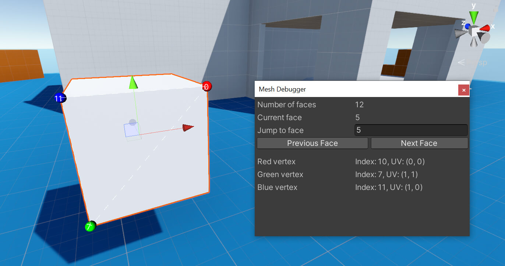

# Mesh Debugger

The **Debug Tools** package includes a custom editor window for debugging and visualizing mesh data. To open this debugger, use the menu `Window > Analysis > Mesh Debugger`.

When a mesh is selected in the hierarchy while the window is open, a wireframe will be drawn around the current face of the mesh, and vertex and UV information will be shown in the editor. The window provides buttons to move to the next or previous face.

